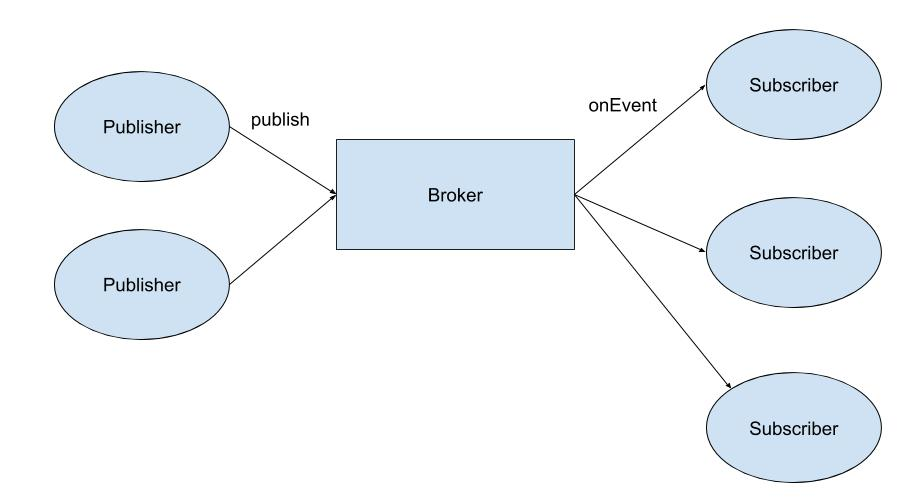
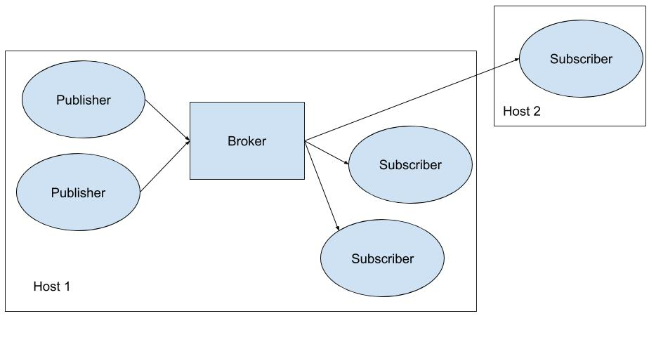
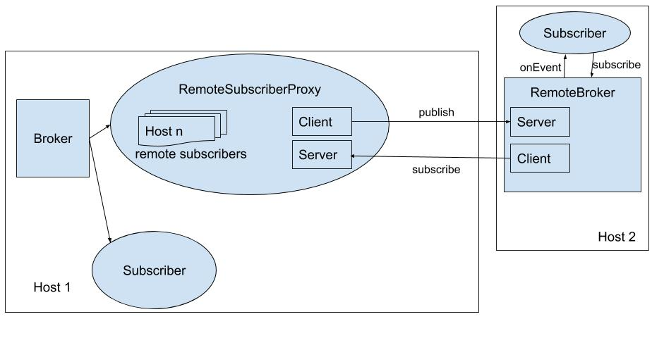

Publish/Subscribe Framework
=======================================

For this project, I have implemented a message broker framework that will support [publish/subscribe](https://en.wikipedia.org/wiki/Publish%E2%80%93subscribe_pattern) functionality. I have used following:

- Concurrency and threads
- Sockets
- Java Generics
- Good design practices

This Project has two parts:

- Part 1 (95%) - Part 1 implements a program that will run as a single Java process on one host. 
- Part 2 (5%) - Part 2 implements a program that will allow a `Subscriber` to be executed on a remote host. This requires implementing client/server functionality as part of solution.

## Requirements (Part 1)

I have implemented a framework with the following architecture:



Any number of publishers may publish data by calling the method `publish` on the `Broker`. Any number of subscribers may `subscribe`, and the `Broker` will deliver each message to all subscribers via the `onEvent` method.

### `Broker`

I have implemented the following interface for the `Broker`.

```java
public interface Broker<T> {

	/**
	 * Called by a publisher to publish a new item. The 
	 * item will be delivered to all current subscribers.
	 * 
	 * @param item
	 */
	public void publish(T item);
	
	/**
	 * Called once by each subscriber. Subscriber will be 
	 * registered and receive notification of all future
	 * published items.
	 * 
	 * @param subscriber
	 */
	public void subscribe(Subscriber<T> subscriber);
	
	/**
	 * Indicates this broker should stop accepting new
	 * items to be published and shut down all threads.
	 * The method will block until all items that have been
	 * published have been delivered to all subscribers.
	 */
	public void shutdown();
}
```

The following *three* concrete `Broker` implementations implements this interface.

#### `SynchronousOrderedDispatchBroker`

The `SynchronousOrderedDispatchBroker` has the following properties:

- **Synchronous** - A newly published item will be *synchronously* delivered to all subscribers. The `publish` method will not return to the publisher until all subscribers have completed the `onEvent` method.
- **Ordered** - The `Broker` guarantees that items from different publishers *may not interleave*. If a publisher is delivering to subscribers the next publisher must block until the first has finished.

<hr/>

#### `AsyncOrderedDispatchBroker`

The `AsyncOrderedDispatchBroker` has the following properties:

- **Asynchronous** - A newly published item will be *asynchronously* delivered to all subscribers. The `publish` method will return to the publisher immediately, and the item will be delivered to the subscribers after the `publish` method completes.
- **Ordered** - The `Broker` guarantees that items from different publishers will be delivered to each subscriber *in the same order*. If any subscriber receives item1 before item2 then all subscribers will receive item1 before item2.

**Implementation idea**

- Consider using a `BlockingQueue` to queue new items as they are published. 
- Consider using one additional thread to deliver messages to subscribers in order.

<hr/>

#### `AsyncUnorderedDispatchBroker`

The `AsyncUnorderedDispatchBroker ` has the following properties:

- **Asynchronous** - A newly published item will be *asynchronously* delivered to all subscribers. The `publish` method will return to the publisher immediately, and the item will be delivered to the subscribers after the `publish` method completes.
- **Unordered** - The `Broker` makes no guarantees about the order in which items are delivered to the subscribers. 

**Hints**

- Consider using an instance of `ExecutorService` to asynchronously `execute` jobs to deliver items to subscribers. 

<hr/>

### `Subscriber`

The `Subscriber` interface is implemented as follows:

```java
public interface Subscriber<T> {

	/**
	 * Called by the Broker when a new item
	 * has been published.
	 * @param item
	 */
	public void onEvent(T item);
	
}
```

### Test Application

The framework described above will be implemented such that it could support a variety of applications. A `Broker` could handle any type of item, which is why we have used Generics.

In this project, I have implemented an application that will re-sort the Amazon reviews data set. Currently, the data is sorted by type of product (i.e., cell phones, home and kitchen, etc). Your demonstration application will use the publish/subscribe framework to create two new .json files---one with old reviews and one with new reviews.

#### Publishers

1. You will implement at least *two* publishers. 
2. Each publisher must run in a separate thread.
3. Each publisher will be responsible for *one* of the 5-core reviews files from the [Amazon product data](http://jmcauley.ucsd.edu/data/amazon/) dataset. You may choose which files to use.
4. The publisher will parse each review as a separate JSON object and publish the object as a single item.

#### Subscribers

1. I have implemented *two* subscribers.
2. All subscribers will receive all items. One subscriber will filter items and save to a file only the older reviews and the other will filter items and save to a file only the newer reviews.
3. I am using a unix review time of 1362268800 to separate old and new. This yields roughly 774,000 new reviews and 529,000 old reviews using the data sets recommended above.

#### Brokers

1. I am using this test application to *compare the performance* of the three `Broker` implementations.

### External Libraries

The only external libraries that are used for this assignment are [GSON](https://github.com/google/gson) 2.8.5 and JUnit.

## Requirements (Part 2)



### Hints

1. Host 1 will need to implement a server that allows a remote subscriber to send a registration message.
2. When a remote subscriber is executed, it will connect to the registration server.
3. When a new item is published it will be forwarded from Host 1 to Host 2, then delivered to the subscriber.
4. There are lots of ways to design a solution, however it is recommended that you modify the part 1 solution as little as possible. I have done this by implementing a `RemoteSubscriberProxy` that behaves like a normal `Subscriber` to the `Broker` on Host 1 but implements a server to accept connections from Host 2 and a client to forward items to Host 2. On Host 2, I implement a `RemoteBroker` that behaves like a normal `Broker` to the `Subscriber` on Host 2 but proxies messages coming from the `RemoteSubscriberProxy`. The figure below shows this implementation, omitting detail of the original publishers.
 	

